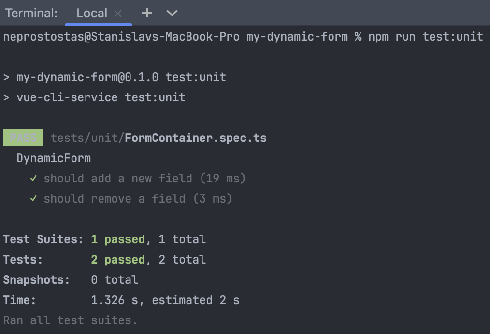

<!DOCTYPE html>
<html lang="en">
<head>
    <meta charset="UTF-8">
    <meta name="viewport" content="width=device-width, initial-scale=1.0">
    <title>Dynamic Form Project</title>
</head>
<body>

<h1>Project "Dynamic Form"</h1>

This project is an example of a dynamic form created using Vue 3 and TypeScript. It includes the ability to add and remove form fields, count vowels in each field, and highlight fields that match the search query.

<h2>Installation</h2>

<ol>
    <li>
        <strong>Clone the repository:</strong>
        <pre><code>git clone https://github.com/neprostostas/my-dynamic-form</code></pre>
    </li>
    <li>
        <strong>Navigate to the project directory:</strong>
        <pre><code>cd dynamic-form</code></pre>
    </li>
    <li>
        <strong>Install dependencies:</strong>
        <pre><code>npm install</code></pre>
    </li>
</ol>

<h2>Running the Project</h2>

<ol>
    <li>
        <strong>Start the local development server:</strong>
        <pre><code>npm run serve</code></pre>
        
This command will start a local server at <a href="http://localhost:8080">http://localhost:8080</a>, where you can view your project.

    </li>
</ol>

<h2>Running Unit Tests</h2>

The project includes unit tests written using Vue Test Utils and Jest. To run the unit tests, execute the following command:

<pre><code>npm run test:unit</code></pre>

This command will run all the unit tests located in the <code>tests/unit</code> directory and display the test results in the console.

<h2>Project Structure</h2>

<ul>
    <li><code>src/components</code>: Contains Vue components.</li>
    <li><code>src/views</code>: Contains views for routing.</li>
    <li><code>tests/unit</code>: Contains unit tests for components.</li>
</ul>

<h2>Requirements</h2>

<ul>
    <li>Node.js (version 14 or newer)</li>
    <li>npm (version 6 or newer)</li>
</ul>

<h2>Author</h2>

Stanislav Kinash, 2024

</body>
</html>
